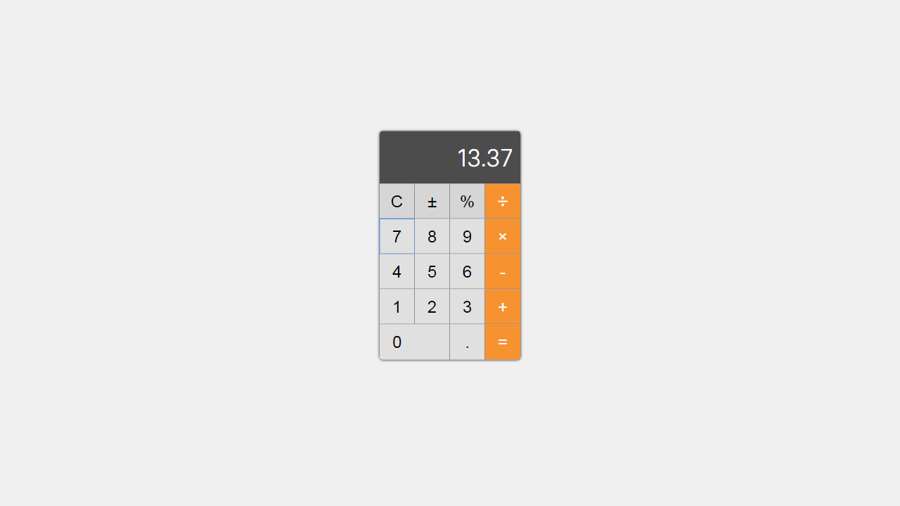

# Calculator
Simple Mac calculator in React



## Getting Started
These instructions will get you a copy of the project up and running on your local machine for developement purposes.

### Prerequisties
In order to run project You must have __NodeJS__ installed on your machine. Otherwise you won't be able to start application.

### Running

1. To run project make sure you have NodeJS installed.
2. Navigate to calculator root directory and execute following commands to run application:
```
npm install
npm start
```

If everything goes well you will get calculator running on http://localhost:8080
